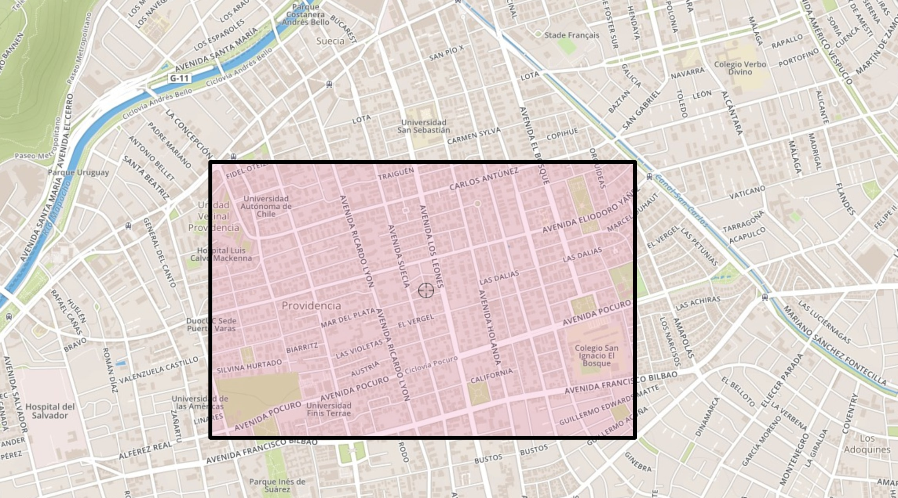
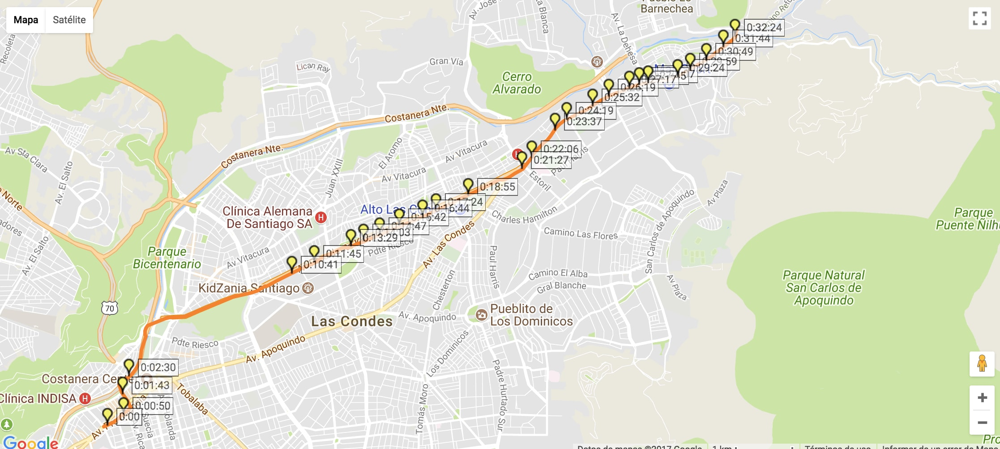

# Guía de Uso

## 1) Trabajar con mapas (elementos geolocalizados)

Actualmente hay 4 tipos de elementos con información de geolocalización (latitud, longitud):
1. [Paraderos](api.md?id=stops): Posición de paraderos.

2. [Buses](api.md?id=buses): Posición de buses.

3. [Puntos de carga BIP](api.md?id=bip-spots-puntos-carga): Ubicación de puntos de carga BIP

4. [Trazado de servicio](api.md?id=secuencia-de-detenci%c3%b3n-para-viaje): Los distintos puntos del recorrido para un servicio específico.


Existen 2 filtros de geolocalización que permiten filtrar los elementos anteriores en base a operaciones: [Centro y Radio](#centro-y-radio) y [Bounding Box](#bounding-box)

### Centro y Radio

Puedes filtrar/ordenar los datos, indicando un centro y un radio en metros (opcional), los elementos se ordenan por cercanía. Nota: Estas respuestas vienen con paginación (de a 100 elementos). Ejemplos:

Listar los paraderos en base a un centro (ordenados por cercanía).

```
https://api.scltrans.it/v1/stops?center_lat=-33.491585&center_lon=-70.643562
```

Listar los paraderos en un radio de `2000` metros de un centro

```
https://api.scltrans.it/v1/stops?center_lat=-33.491585&center_lon=-70.643562&radius=2000
```

Listar los buses en un radio de `5000` metros de un centro 

```
https://api.scltrans.it/v1/buses?center_lat=-33.491585&center_lon=-70.643562&radius=5000
```

### Bounding Box

Si deseas filtrar los elementos en una zona específica, puedes indicar un bounding box. Para lo anterior debes indicar los 4 extremos (coordenadas), en el siguiente orden:
    
1. Longitud mínima

2. Latitud mínima

3. Longitud máxima

4. Latitud máxima

Ejemplo:

Listar los paraderos en el bbox: `-70.615053,-33.438246,-70.591836,-33.425639` (Longitud mínima, Latitud mínima, Longitud máxima, Latitud máxima).



```
https://api.scltrans.it/v1/stops?bbox=-70.615053,-33.438246,-70.591836,-33.425639
```

?> **NOTA** Adicionalmente a los endpoints anteriores, existe un [endpoint](api.md?id=map) a modo de "helper" que reúne los elementos con latitud, longitud en un único método para facilitar la consulta.

## 2) Todo sobre un recorrido

Utilizaremos como ejemplo el recorrido `411`

La información básica del recorrido puede ser obtenida de:

```
https://api.scltrans.it/v1/routes/411
```
Esta información incluye nombre, destinos, agencia y otros datos básicos del recorrido. Si necesitas información más detallada sobre el recorrido puedes consultar por los detalles de las direcciones del recorrido:

```
https://api.scltrans.it/v2/routes/411/directions
```

Esta respuesta incluye información detallada para la ida y regreso (direcciones) del recorrido, incluyendo el [trazado del recorrido](api.md?id=shape) (`shape`) y la [secuencia de detenciones](api.md?id=stoptime) (`stop_time`).



Si lo deseas, puedes obtener la información para una dirección en particular (ida:0 /regreso: 1) con:

```
https://api.scltrans.it/v2/routes/411/directions/<direction_id>
```

Ejemplo:

```
https://api.scltrans.it/v1/routes/411/directions/0
```

## 3) Todo sobre un paradero

Utilizaremos como ejemplo el paradero `PI406`

La información básica del paradero puede ser obtenida de:

```
https://api.scltrans.it/v1/stops/PI406
```
Si deseas conocer los recorridos del paradero puedes hacer la siguiente consulta:

```
https://api.scltrans.it/v1/stops/PI406/stop_routes
```
La respuesta es una lista de [StopRoutes](api.md?id=stoproute) (pares de dirección, route) para todos los recorridos del paradero.
La [dirección](api.md?id=direction-simplificada) te permite conocer si el bus es ida/regreso y el nombre del destino (el nombre del letrero del bus), entre otros campos. [Route](api.md?id=route) es un objecto que muestra información básica acerca del recorrido.


## 4) Información en tiempo real (`arribos y ubicación de buses`)

### Estimación de tiempo de arribo a paradero

Si deseas consultar por los próximos arribos en un paradero específico (en este caso `PB8`):

```
https://api.scltrans.it/v1/stops/PB8/next_arrivals
```
 
La respuesta de esta consulta es una lista de [arribos](api.md?id=arrival), incluyendo un texto con la descripción de la estimación de tiempo e información extra. 

### Tracking de buses 

En algunos casos, la respuesta de la estimación de tiempos de arribo incluye la patente del bus (`bus_plate_number`) que se traslada al paradero . Si deseas saber más información acerca de uno de los buses que se traslada al paradero, incluyendo ubicación, puede hacer una consultar utilizando la patente provista (para ejemplo utilizaremos la patente `ZN-6729`):


```
https://api.scltrans.it/v1/buses/ZN-6729
```

Esta información es actualizada cada 1 minuto. Si deseas mostrar el movimiento del bus hacia el paradero, la respuesta incluye la orientación del bus (`bus_movement_orientation`) y su velocidad instantánea (`bus_speed`). Esta información puede ser combinada con el trazado del recorrido para mostrar el trayecto del bus.  


